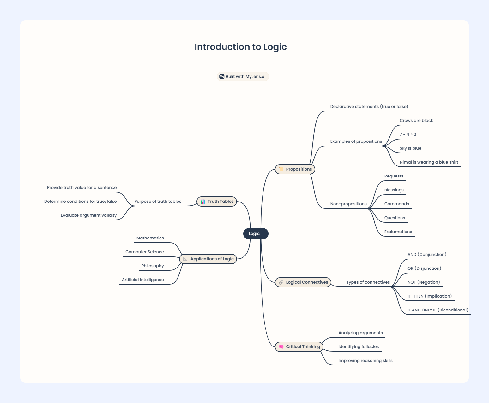

## Session 1: Introduction to Logic

### Propositions
- A **proposition** is a declarative statement that is either true or false, but not both simultaneously.
  - Example: "Crows are black", "7 − 4 > 2"
  - **Not propositions**: Requests, commands, questions.

### Truth Tables
- Truth tables show the truth values of a statement or its components.
  - Example: 
    - "Crows are black" (P)  
      P | T | F
    - "Crows are black and have wings" (P1 ∧ P2)

### Logical Connectives
- **NOT** (¬): Negation of a proposition.
- **AND** (∧): Both propositions must be true.
  - Example: "Crows are black and have wings."
- **OR** (∨): At least one proposition must be true.
  - Example: "Saman is in the classroom or reading a book."
- **IF...THEN** (→): Conditional statements.
  - Example: "If Saman is in the classroom, then he has come to school."

### Compound Propositions
- Example: **p ∧ ¬q → r** translates to "Saman is reading a book, but he is not in the classroom, then he has come to school."

---

---
<!-- 2025 - 03 - 24 
@Asitha Kanchana Palliyaguru-->