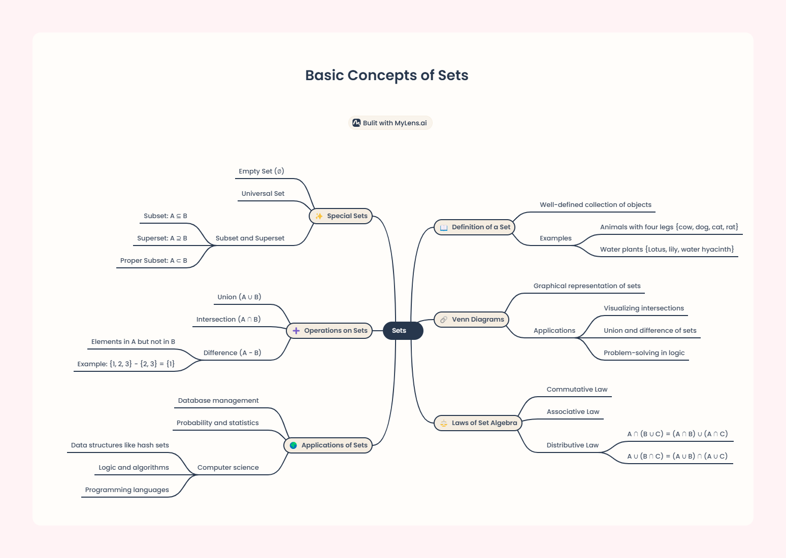

## Session 2: Basic Concepts of Sets

### Definition of a Set
- A **set** is a well-defined collection of objects.
  - Example: Animals with four legs `{cow, dog, cat, rat}`.
  - **Notation**: `x ∈ A` means "x is an element of A."

### Types of Sets
- **Finite Set**: Contains a finite number of elements.
  - Example: `{1, 2, 3, 4, 6, 8, 9}`.
- **Infinite Set**: Contains an infinite number of elements.
  - Example: `{1, 2, 3, ...}` (set of all natural numbers).

### Special Sets
- **Null Set**: A set with no elements, denoted as `∅`.
  - Example: `{x ∈ ℕ | x < 2 and x² > 5} = ∅`.
- **Singleton**: A set with only one element.
  - Example: `{2}`.

### Subsets
- **Subset**: Set B is a subset of set A if all elements of B are in A.
  - Example: `B ⊆ A`.
- **Proper Subset**: Set B is a proper subset of A if B is contained within A but is not equal to A.
  - Example: `B ⊂ A`.

### Operations on Sets
- **Union ( ∪ )**: Combines all elements from two sets.
  - Example: `{2,4,5} ∪ {4,6,7} = {2, 4, 5, 6, 7}`.
- **Intersection ( ∩ )**: Elements common to both sets.
  - Example: `{2,4,6} ∩ {4,6,8} = {4, 6}`.
- **Difference ( − )**: Elements in one set but not in the other.
  - Example: `{2,4,6} − {4,6} = {2}`.
- **Complement ( A' )**: Elements in the universal set but not in A.

### Venn Diagrams
- Visual representations of sets and their relationships.

### Cartesian Product ( × )
- The set of all ordered pairs from two sets.
  - Example: `A = {-2, 8}, B = {-3, 2}`.
  - `A × B = {(-2, -3), (-2, 2), (8, -3), (8, 2)}`.
